# hse_hw2_chip

## Информация о выполненной работе
**Выполнила:** Романова Анастасия, группа 2

[Ссылка на google colab](https://colab.research.google.com/drive/1XK5VXj8fOy5NFI9-2KALtZi6sq-NvYDO?usp=sharing)

Показатель | Выбранное значение 
--- | --- 
Клеточная линия | A549
Гистоновая метка | H3K4me2 
ID Реплики 1 | ENCFF671XBU 
ID Реплики 2 | ENCFF696CIT 
ID контроля | ENCFF126TIE
Хромосома выравнивания | chr16

## FastQC

### ENCFF671XBU
Per base sequence quality | Per sequence GC content | Adapter content
--- | --- | ---
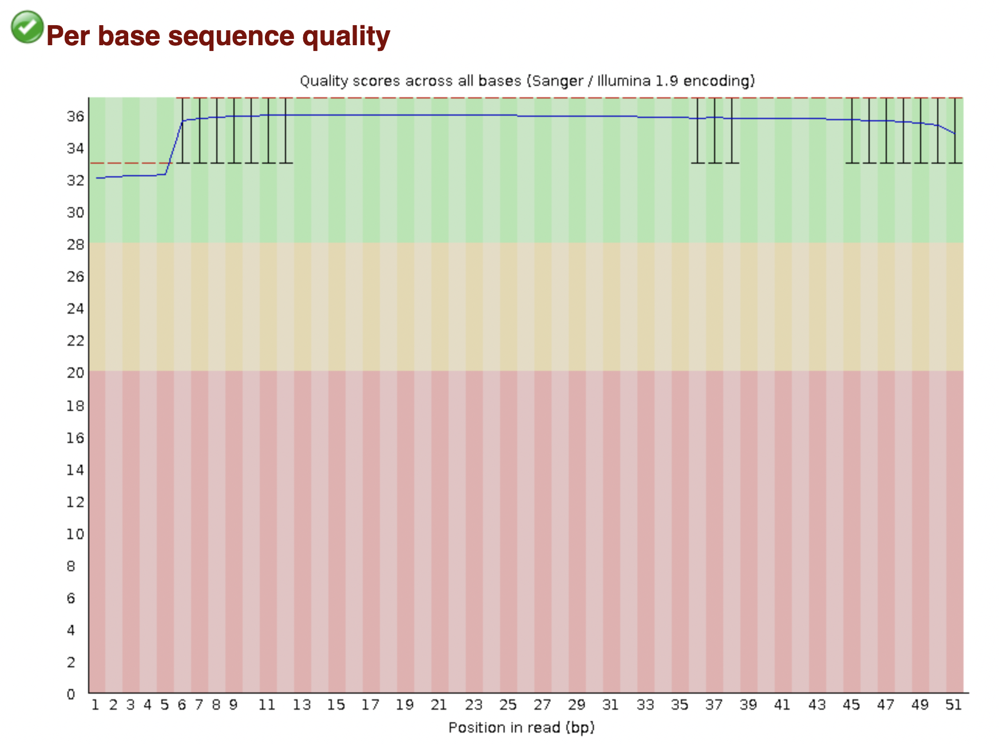 | 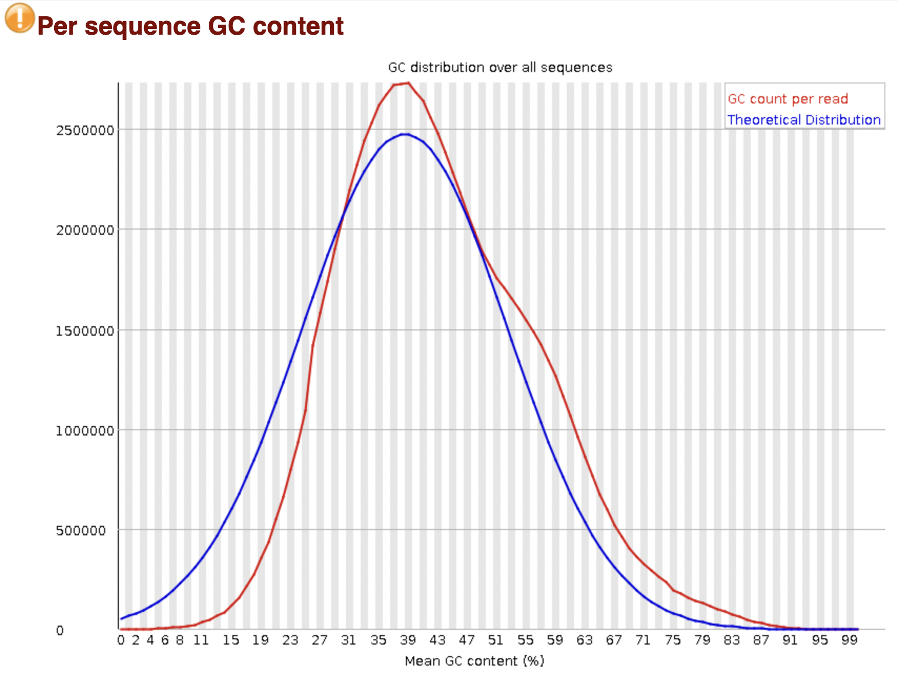 | 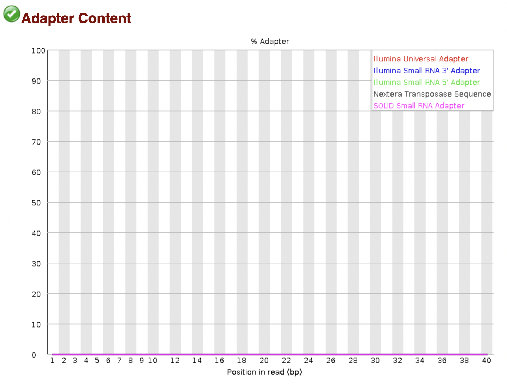

- На графике `Per base sequence quality` все показатели в зеленой зоне (с небольшим уменьшением к концу), что говорит о хорошем качестве прочтений.
- График `Per sequence GC content` очень похож на эталонный.
- По графику `Adapter content` понятно, что лишних адаптеров нет.

**Из этих графиков можно сделать вывод, что качество оказалось хорошим.**

### ENCFF696CIT
Per base sequence quality | Per sequence GC content | Adapter content
--- | --- | ---
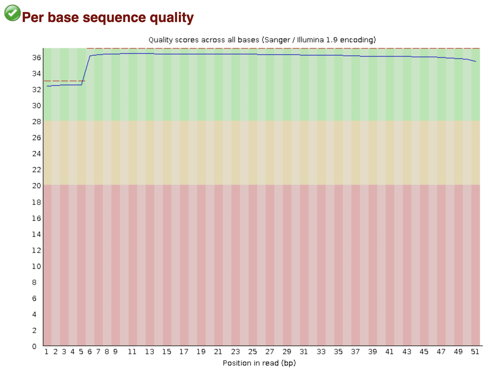 | 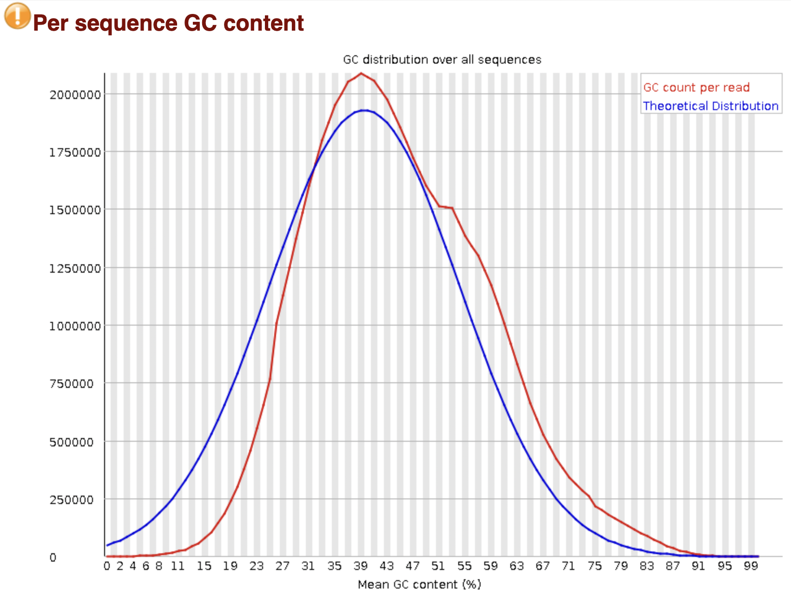 | 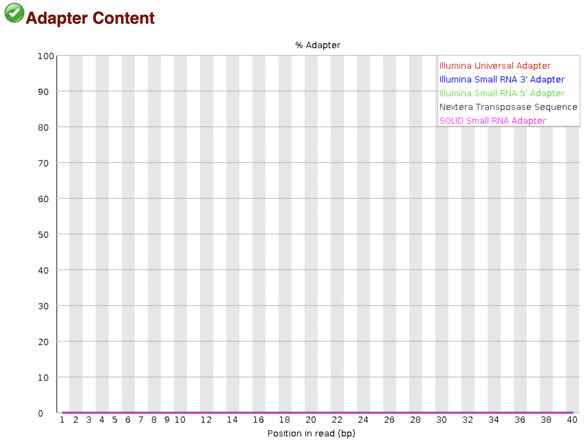

- График `Per base sequence quality` очень похож на график первой реплики и говорит о хорошем качестве прочтений.
- График `Per sequence GC content` также очень похож на эталонный.
- По графику `Adapter content` вновь понятно, что лишних адаптеров нет.

**Из этих графиков можно опять же сделать вывод, что качество оказалось хорошим.**

### ENCFF126TIE
Per base sequence quality | Per sequence GC content | Adapter content
--- | --- | ---
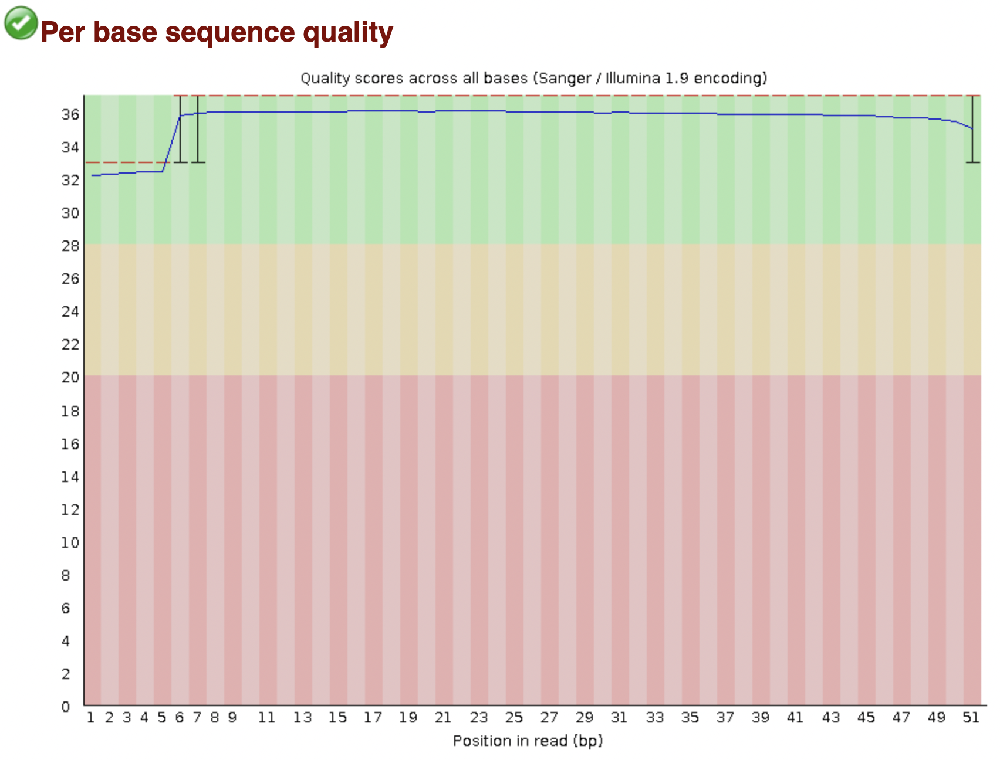 | 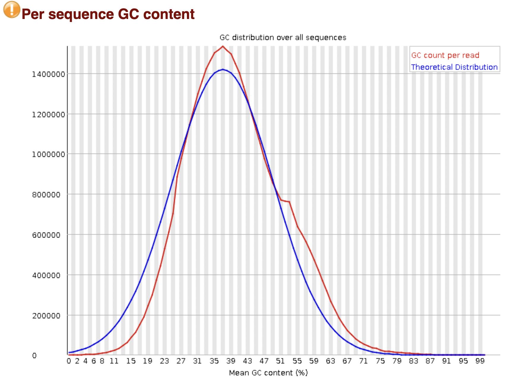 | 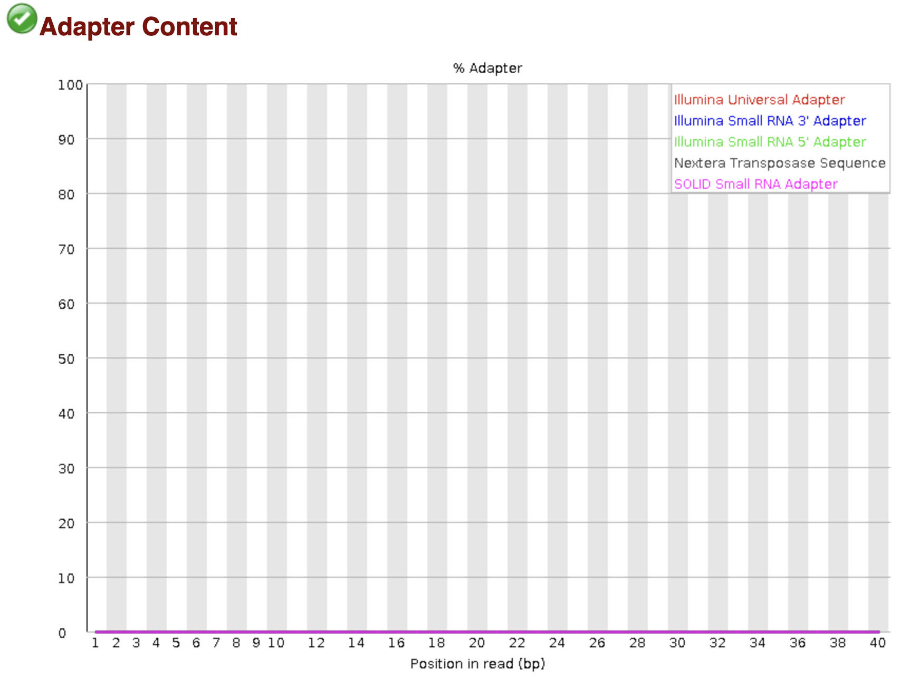

- График `Per base sequence quality` очень похож на график первой реплики и говорит о хорошем качестве прочтений.
- График `Per sequence GC content` также очень похож на эталонный.
- По графику `Adapter content` вновь понятно, что лишних адаптеров нет.

**Из этих графиков можно опять же сделать вывод, что качество оказалось хорошим.**

## Диаграммы Венна

Diagram 1 | Diagram 2
--- | ---
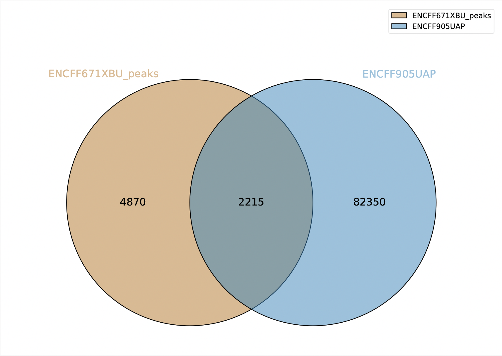 | 

Данные для пересечения X с Y не совпадают с пересечением Y с X, так как пересечение в данном случае считается как количество участков встречи в первом файле, которые встречаются и во втором тоже.

Diagram 1 | Diagram 2
--- | ---
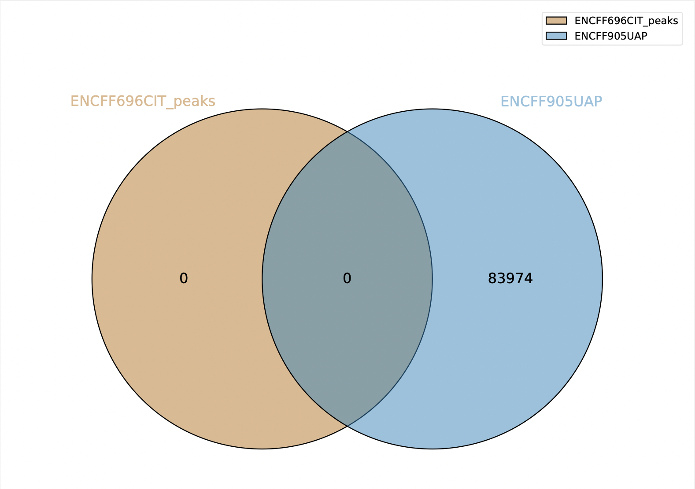 | 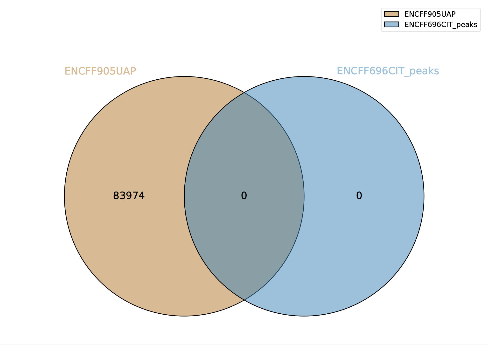

Отсутсвие пересечений связано с тем, что мы производим выравнивание только на одну хромосому. Если бы выравнивание делали на все хромосомы, то шанс пересечения был бы больше.

## Cтатистика по выравниванию

index | Общее количество ридов | Не выровнилось | Выровнилось ровно 1 раз | Выровнилось более 1 раза | Общий процент выравнивания
--- | --- | --- | --- | --- | ---
ENCFF671XBU | 44155295 | 38351885 \(86.86%) | 1563249 \(3.54%) | 4240161 \(9.60%) | 13.14%
ENCFF696CIT | 35895288 | 31132107 \(86.73%) | 1277589 \(3.56%) | 3485592 \(9.71%) | 13.27%
ENCFF126TIE | 22021226 | 18530461 \(84.15%) | 785894 \(3.57%) | 2704871 \(12.28%) | 15.85%

**Проанализируйте выдачу bowtie. Почему процент выравниваний получился именно таким?** 

**Ответ**: процент выравниваний получился сравнительно небольшой, так как выравнивали на хромосому, а она она составляет только малую часть от всего генома человека.

## Бонусная часть

Ngs.plot и heatmap ENCFF515ODN.bigWig | Ngs.plot и heatmap ENCFF792WPU.bigWig
--- | ---
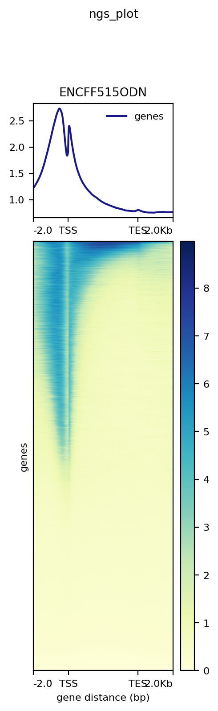 | 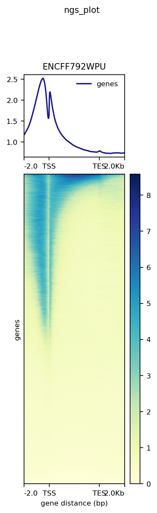
Wall time: 2h 47min 34s | Wall time: 2h 47min 36s

По приколу добавила еще глянуть на время того, сколько это все строилось. А мне пришлось строить это дважды, так как `np.float wad deprecated in numpy 1.20`. Круто? Круто!

**Вывод:** Картинки получились очень похожие между собой. 

Nsg.plot показывает распределение метки Encode относительно генов. Метка расположена в начале последовательности гена, что совпадает с ожиданиями из теоретической разметки.
